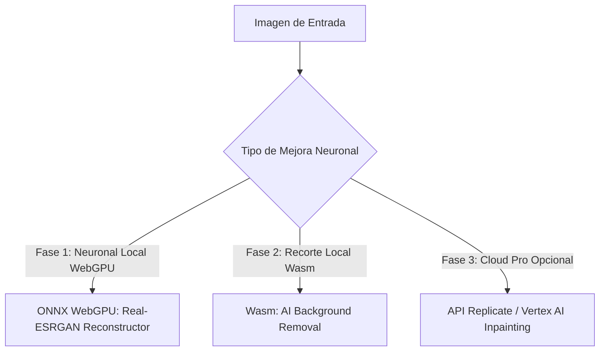

# 🚀 Roadmap: Mejoras Futuras & Edición Neuronal con IA

Este documento especifica las opciones técnicas y el plan de implementación para las **futuras actualizaciones de Inteligencia Artificial profunda** en **Web-Sling Optimizer**.

---

## 🎯 Próximos Objetivos

1. **Reconstrucción Neuronal Profunda**: Reconstruir texturas faltantes y rostros borrosos mediante redes convolucionales locales.
2. **Remoción de Fondos con IA**: Aislar productos, personas y logos en 1 clic generando PNG transparentes automáticamente.
3. **Fidelidad Cloud Opcional**: Conectar APIs de generación fotorrealista (Replicate / Imagen 3) para usuarios con API Keys propias.
4. **Filosofía**: Mantener privacidad en el cliente, costo $0 y máxima velocidad.

---

## 🏗️ Fases Futuras de Implementación

---

### 🔹 Fase 1: Super-Resolución Neuronal en el Cliente (Real-ESRGAN / ONNX WebGPU)
> **Prioridad:** Alta | **Costo:** $0 | **Privacidad:** 100% en el navegador | **Tecnología:** `onnxruntime-web` + WebGL/WebGPU

#### ¿Cómo funcionará?
- Ejecutará una red neuronal convolucional entrenada para sintetizar detalles fotorrealistas en fotos degradadas o muy comprimidas.
- Correrá directamente en la tarjeta gráfica del usuario (GPU local) a través de WebGPU.
- **Modelo recomendado:** `Real-ESRGAN-Compact` o `Compact-Anime6B` (~15 MB - 25 MB en formato ONNX, cacheado en IndexedDB para no requerir descargas repetidas).

#### Ventajas:
- Reconstruye fotos borrosas o pixeladas y las transforma en imágenes nítidas de alta definición.
- Sin costo de servidores externos ni cuotas de API.

---

### 🔹 Fase 2: Remoción Automática de Fondo con IA (*AI Background Removal*)
> **Prioridad:** Media | **Costo:** $0 | **Tecnología:** `@imgly/background-removal` o `bria-rmbg-web`

#### ¿Cómo funcionará?
- Detectará automáticamente el sujeto principal (personas, productos e-commerce, logotipos) y eliminará el fondo sustituyéndolo por transparencia PNG o fondo blanco.
- Se ejecutará 100% en WebAssembly / ONNX en el navegador del usuario.

#### UI / Interfaz:
- Botón en la barra de acciones de la tabla y cuadrícula: **"✂️ Quitar Fondo IA"**.

---

### 🔹 Fase 3: Conectores Cloud Pro Opcionales (Para Usuarios con API Key)
> **Prioridad:** Baja / Complementaria

Para usuarios que deseen calidad cinematográfica o *inpainting* generativo:
- Soporte para configurar API Key de **Replicate (NightWare/Real-ESRGAN)** o **Google Imagen 3 (Vertex AI)**.
- Mismo patrón que la configuración de Gemini/OpenAI (almacenamiento seguro en `localStorage`).

---

## 🎨 Especificaciones de Interfaz de Usuario Futuras (UI/UX)

1. **Comparador Interactivo Antes / Después (*Split Slider*):**
   - Modal con deslizador vertical para inspeccionar el antes (baja calidad) vs el después (reconstrucción neuronal).
2. **Badge en la Tabla:**
   - Indicador visual `✂️ Sin Fondo` o `🧠 Neural HD` en las imágenes procesadas con IA local.
3. **Selector de Intensidad de Nitidez:**
   - Selector fino: *Suave (Retrato)*, *Medio (Fotografía)*, *Agresivo (Texto / Gráficos)*.

---

## 📋 Checklist de Próximas Tareas

- [ ] **Prototipo WebGPU:** Integrar `onnxruntime-web` y cargar modelo liviano `Real-ESRGAN-Compact.onnx`.
- [ ] **Wasm Background Removal:** Evaluar y probar paquete `@imgly/background-removal` para recorte de siluetas en el cliente.
- [ ] **Modal Split Slider:** Crear componente de comparación interactiva de pantalla dividida (*Before / After*).
- [ ] **Integración de Presets:** Añadir opción "Auto-remover fondo" a los presets rápidos.
