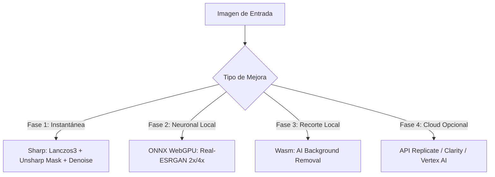

# 🚀 Roadmap: Super-Resolución, Upscaling & Mejoras con IA

Este documento especifica la arquitectura, opciones técnicas y plan de implementación para incorporar **aumento de resolución (2x / 4x)**, **mejora de calidad visual** y **edición neuronal** en futuras actualizaciones de **Web-Sling Optimizer**.

---

## 🎯 Objetivo

Permitir que los usuarios tomen imágenes pequeñas o de baja calidad (con compresión antigua, desenfoque o baja resolución) y puedan:
1. **Duplicar o cuadruplicar su resolución (2x / 4x)** manteniendo bordes definidos.
2. **Eliminar ruido y artefactos JPEG** sin perder nitidez.
3. **Remover el fondo con IA** en un clic.
4. **Mantener la filosofía del proyecto:** Máxima velocidad, privacidad total en el cliente y costo $0.

---

## 🏗️ Fases de Implementación Propuestas



---

### 🔹 Fase 1: Motor Algorítmico Nativo (Lanczos3 + Unsharp Masking + Denoise)
> **Prioridad:** Alta | **Costo:** $0 | **Latencia:** < 50ms | **Dependencias nuevas:** Ninguna (ya usa `sharp`)

#### ¿Cómo funciona?
- **Interpolación Lanczos3:** Algoritmo matemático de 3 lóbulos para re-escalar píxeles sin difuminar ni crear bloques toscos.
- **Máscara de Desenfoque No Lineal (*Unsharp Mask*):**
  ```ts
  sharp(buffer)
    .resize(targetWidth, targetHeight, { kernel: 'lanczos3' })
    .sharpen({ sigma: 1.2, m1: 1.5, m2: 0.7 })
    .median(1) // Reducción de ruido de compresión
  ```
- **Filtro de Micro-Contraste:** Realza los detalles de texto y bordes de productos.

#### UI / Interfaz:
- Nuevo interruptor en el panel lateral: **"⚡ Claridad HD & Super-Escala (2x / 4x)"**.
- Opción de 1 clic en la tabla de imágenes.

---

### 🔹 Fase 2: Super-Resolución Neuronal en el Cliente (Real-ESRGAN / ONNX WebGPU)
> **Prioridad:** Media | **Costo:** $0 | **Privacidad:** 100% en el navegador | **Tecnología:** `onnxruntime-web` + WebGL/WebGPU

#### ¿Cómo funciona?
- Ejecuta una red neuronal convolucional entrenada para reconstruir texturas faltantes y sintetizar detalles fotorrealistas.
- Corre directamente en la tarjeta gráfica del usuario (GPU local) a través de los estándares modernos de WebGPU.
- **Modelo recomendado:** `Real-ESRGAN-Compact` o `Compact-Anime6B` (~15 MB - 25 MB en formato ONNX, cacheado en IndexedDB).

#### Ventajas:
- Reconstruye fotos borrosas y las transforma en imágenes nítidas de alta definición.
- Sin costo de servidores externos ni cuotas de API.

---

### 🔹 Fase 3: Remoción Automática de Fondo con IA (*AI Background Removal*)
> **Prioridad:** Media | **Costo:** $0 | **Tecnología:** `@imgly/background-removal` o `bria-rmbg-web`

#### ¿Cómo funciona?
- Detecta automáticamente el sujeto principal (personas, productos e-commerce, logotipos) y elimina el fondo sustituyéndolo por transparencia PNG o fondo blanco.
- Se ejecuta 100% en WebAssembly en el navegador del usuario.

#### UI / Interfaz:
- Botón en la barra de acciones de la tabla: **"✂️ Quitar Fondo IA"**.

---

### 🔹 Fase 4: Conectores Cloud Opcionales (Para Usuarios Pro con API Key)
> **Prioridad:** Baja / Complementaria

Para usuarios que deseen calidad cinematográfica o *inpainting* generativo:
- Soporte para configurar API Key de **Replicate (NightWare/Real-ESRGAN)** o **Google Imagen 3 (Vertex AI)**.
- Mismo patrón que la configuración de Gemini/OpenAI (almacenamiento seguro en `localStorage`).

---

## 🎨 Especificaciones de Interfaz de Usuario (UI/UX)

1. **Comparador Interactivo Antes / Después (*Split Slider*):**
   - Modal con deslizador vertical para inspeccionar el antes (baja calidad) vs el después (super-resolución).
2. **Badge en la Tabla:**
   - Indicador visual `🌟 2X HD` o `✂️ Sin Fondo` en las imágenes optimizadas.
3. **Control de Parámetros:**
   - Selector de nivel de nitidez: *Suave (Retrato)*, *Medio (Fotografía)*, *Agresivo (Texto / Gráficos)*.

---

## 📋 Checklist de Tareas para la Implementación

- [ ] **Backend:** Agregar parámetros `upscaleFactor` y `unsharpMask` en [app/api/compress/route.ts](file:///d:/Dev/CodeProjects/websling/app/api/compress/route.ts).
- [ ] **Tipos:** Extender `types/image.ts` con opciones de mejora de resolución y nitidez.
- [ ] **Frontend:** Añadir control deslizante de *Nitidez / Claridad HD* en [components/SettingsPanel.tsx](file:///d:/Dev/CodeProjects/websling/components/SettingsPanel.tsx).
- [ ] **Pruebas:** Validar rendimiento con imágenes de 200px escaladas a 800px y 1200px.
- [ ] **Integración Neuronal:** Evaluar paquete `@imgly/background-removal` y modelo `Real-ESRGAN` ONNX para modo offline.
